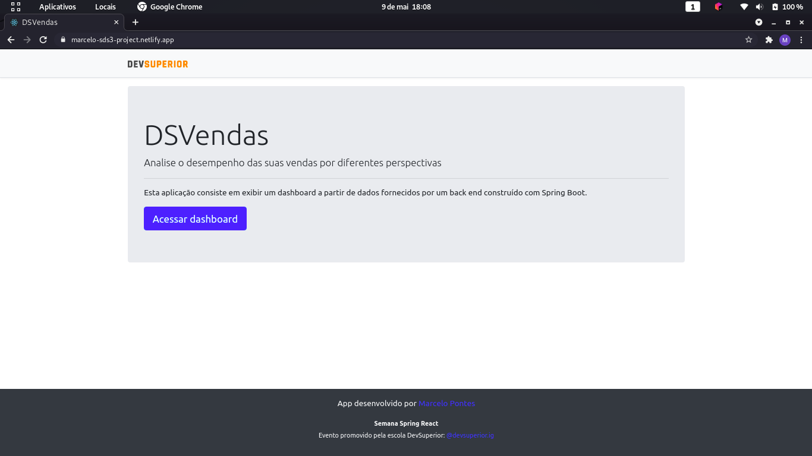
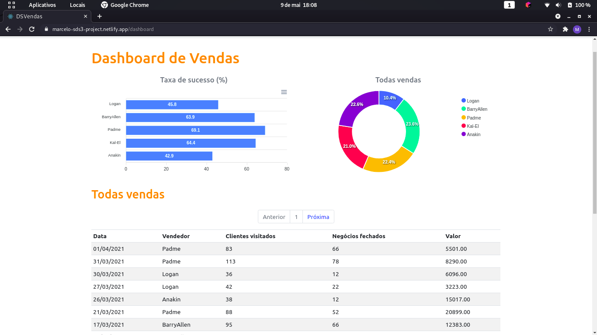

# DSVendas

## Sobre

DSVendas é uma aplicação full stack web construída durante a 3ª edição da Semana DevSuperior, evento organizado pela DevSuperior.

A aplicação consiste em um demonstrativo de vendas, onde os dados são listados e apresentados em gráficos em um dashboard.

<https://marcelo-sds3-project.netlify.app>

## Layout

### Home

### Dashboard

## Tecnologias utilizadas

### Back end
* Java
* Spring Boot
* JPA/Hibernate

### Front end
* HTML / CSS / JS / TypeScript
* Bootstrap
* ReactJS
* Apex Charts

### Implantação em produção
* Back end: Heroku
* Front end: Netlify
* Banco de dados: Postgresql

## Autor

Marcelo Silva de Pontes

<https://www.linkedin.com/in/mspontes360/>
